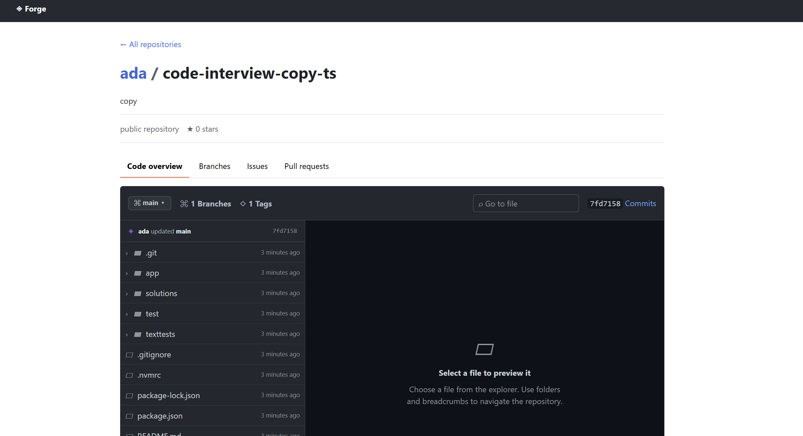
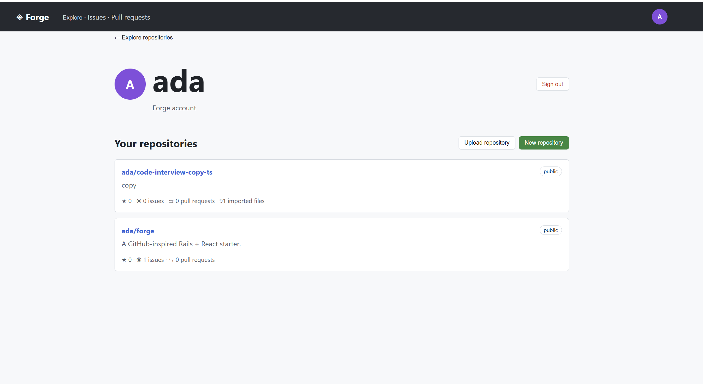
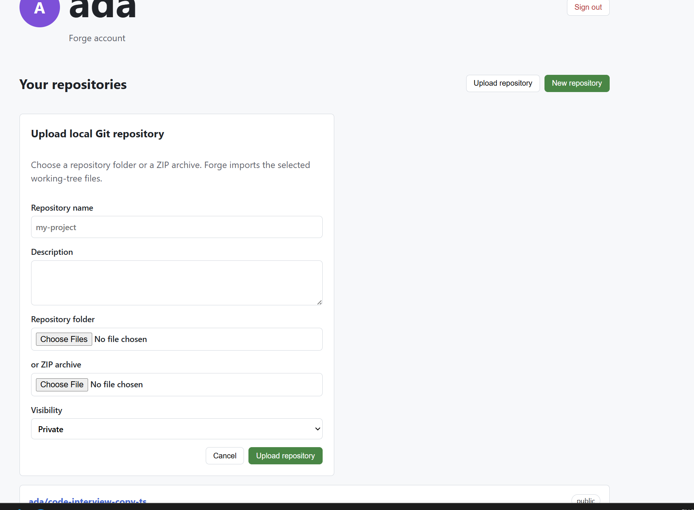
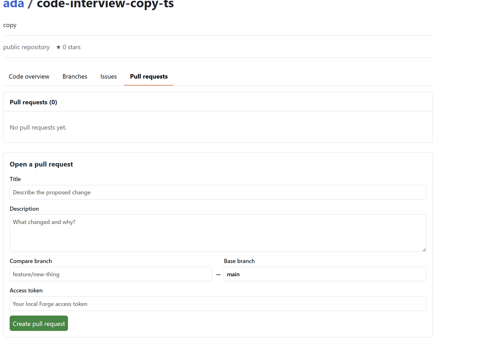
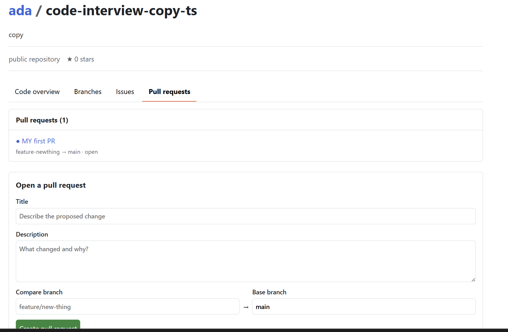
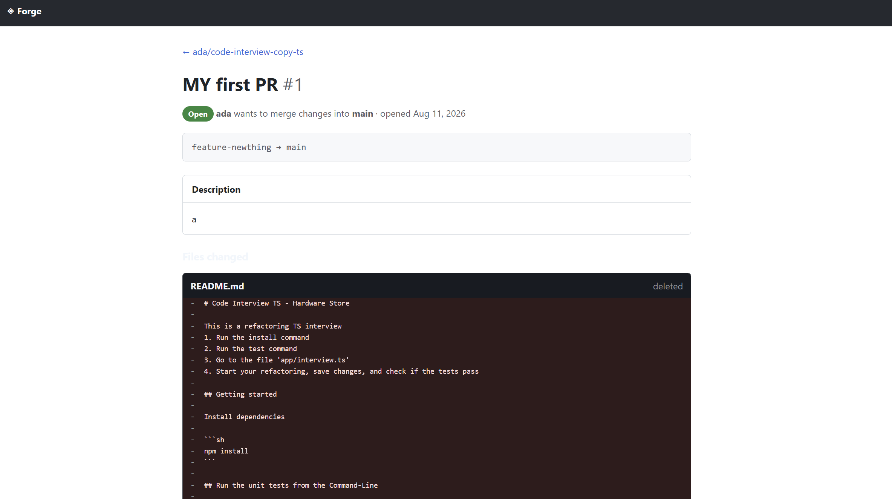
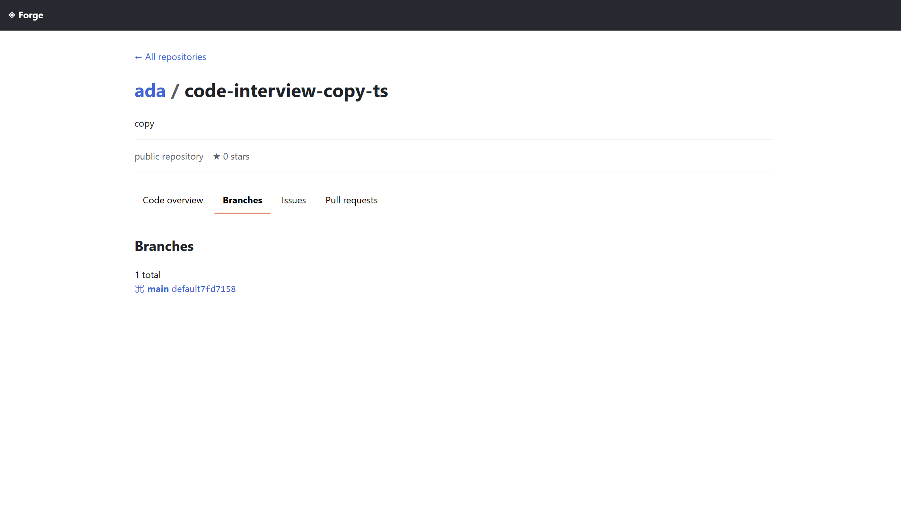
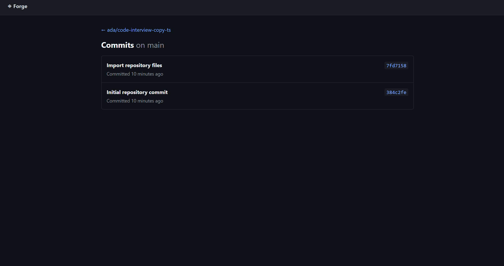
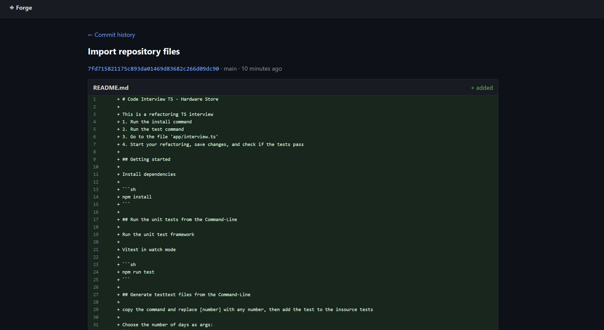

# Forge

!! IN PROGRESS !!

A GitHub-inspired code-hosting starter: Rails owns the API and server-rendered component previews; a Vite React client is delivered as a custom element (`<forge-app>`).

## Code Viewer



## User View



## Create Repo



## Create PR



## PR List



## View PR



## Branch List



## Commit List



## Commit Diff



## Prerequisites

- Ruby 3.3+ and Bundler
- PostgreSQL 15+
- Node 20+ and npm


## Run with Docker (Windows/macOS/Linux)

Install and start [Docker Desktop](https://www.docker.com/products/docker-desktop/), then run from PowerShell in this folder:

```powershell
docker compose up --build

# detach to keep terminal clean
# docker compose up --build --quiet-build -d
```

Open `http://localhost:5173`. Rails is exposed at `http://localhost:3000`; PostgreSQL data persists in the named `postgres_data` volume. The API prepares the database automatically on startup.
The frontend uses polling file watching in Docker so Vite hot reload works reliably with Windows bind mounts.

In another terminal, seed the example data and obtain its access token:

```powershell
docker compose exec api bin/rails db:seed
```

Paste that token into the **New repository** form in the frontend. Forge stores it in the browser's local storage for subsequent repository creation during local development.

## Bearer-token sign-in

Forge uses a local OAuth-style token flow. Register an account or sign in through the frontend; it exchanges credentials for a signed, 24-hour JWT bearer token. New repositories are owned by the JWT's user account.

Set `JWT_SECRET` in `.env` before using this outside local development. The token endpoints are `POST /oauth/register` and `POST /oauth/token`.

## Git remotes (Docker)

Forge ships a local SSH Git service. Start/rebuild the stack, then initialize bare remotes for repositories created before Git support was enabled:

```powershell
docker compose up --build
docker compose exec api bin/rails git:initialize
```

Each repository exposes a clone URL such as `ssh://forge@localhost:2222/ada/forge.git`. The local development password is `forge` (or your `GIT_PASSWORD` value). In Git Bash or PowerShell, add and use the remote:

```sh
git remote add forge ssh://forge@localhost:2222/ada/forge.git
git push forge main
git pull forge main
```

At the initial host-key prompt, confirm `yes`; then enter the Git password. This SSH service is intentionally local-development only—use key-based authentication and authorization before exposing it externally.

Stop the services with `docker compose down`. To also remove the local database data, use `docker compose down -v`.

## Run without Docker

```sh
bundle install
bin/rails db:create db:migrate db:seed
bin/rails server
cd frontend && npm install && npm run dev
```

Visit `http://localhost:5173`. The API is at `http://localhost:3000/api/v1` and component examples are at `/component_previews`.

For local development, use the seeded access token shown by `bin/rails db:seed` in the Sign in screen.

## Design

- `app/models`: users, repositories, issues, pull requests, stars
- `app/controllers/api/v1`: JSON API with bearer-token auth
- `app/components`: [ViewComponent](https://viewcomponent.org/) primitives used by Rails component previews
- `frontend`: React rendered inside a standards-based custom element, so it can be embedded in any host page

This is a product scaffold, not a Git smart-protocol implementation. Repository source/refs, Actions, permissions, webhooks, and production authentication are intentionally future work.
